# Atlas Todo

[](https://github.com/atlastodo/atlas-todo/actions/workflows/ci.yml)
[](./LICENSE)

Atlas Todo is a self-hostable to-do app with end-to-end encryption. You run one small server
(Rust + PostgreSQL). The same app runs in the browser, on Android and on the Linux desktop. It
works offline and syncs when it is back online. The server stores your tasks, but it cannot
read them.

> Status: pre-1.0. Releases are tagged `vX.Y.Z`, and only the latest one gets fixes.

<p>
  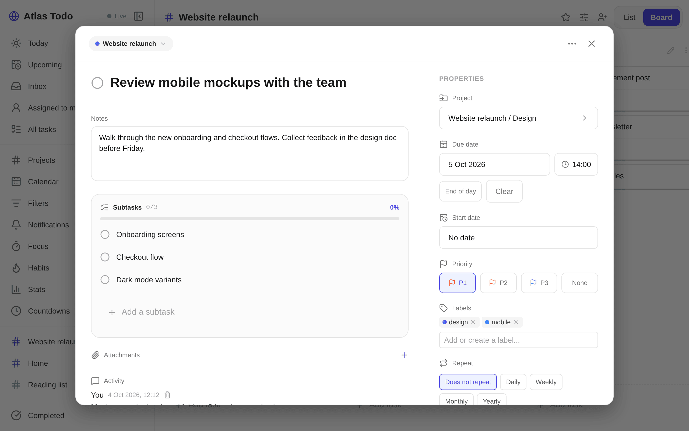
</p>

<p>
  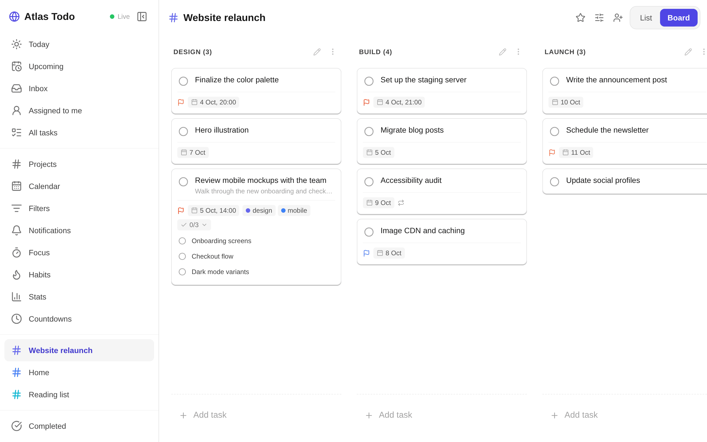
  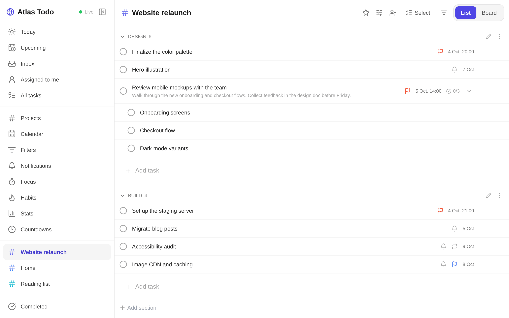
  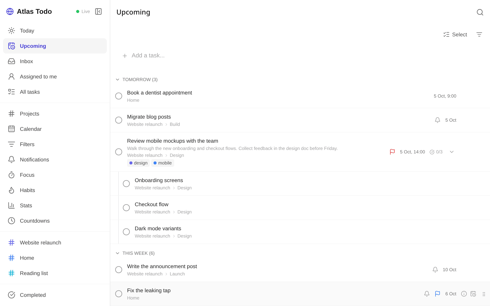
  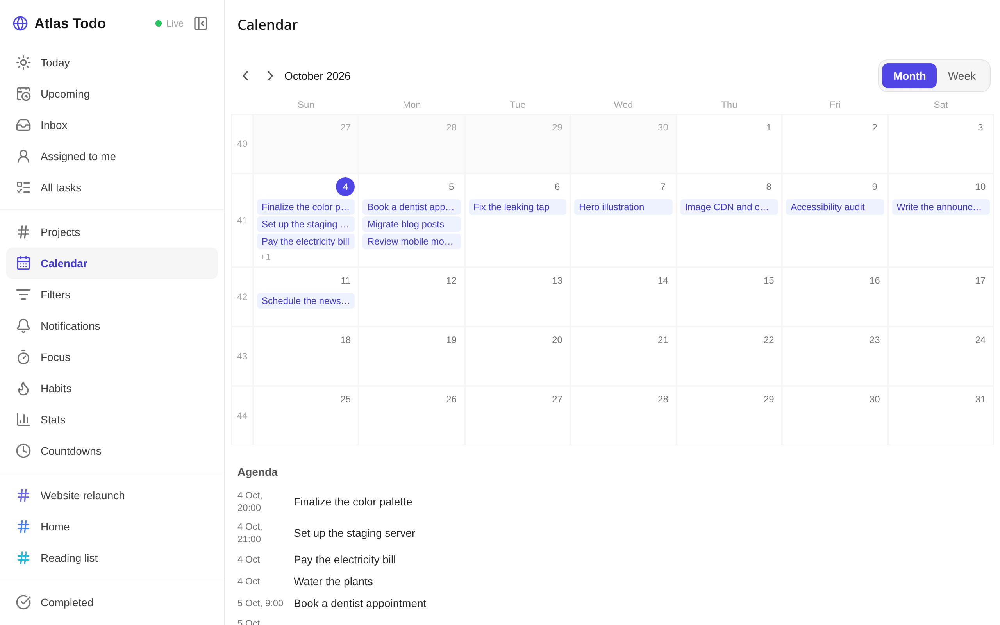
  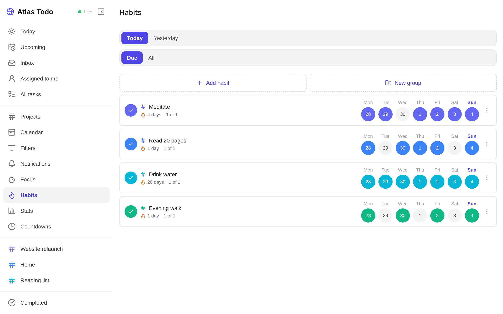
  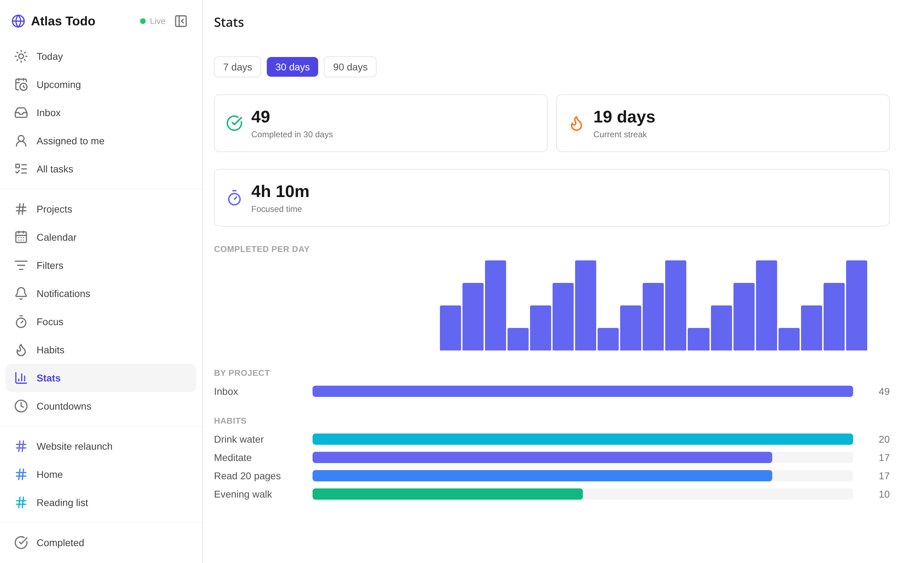
  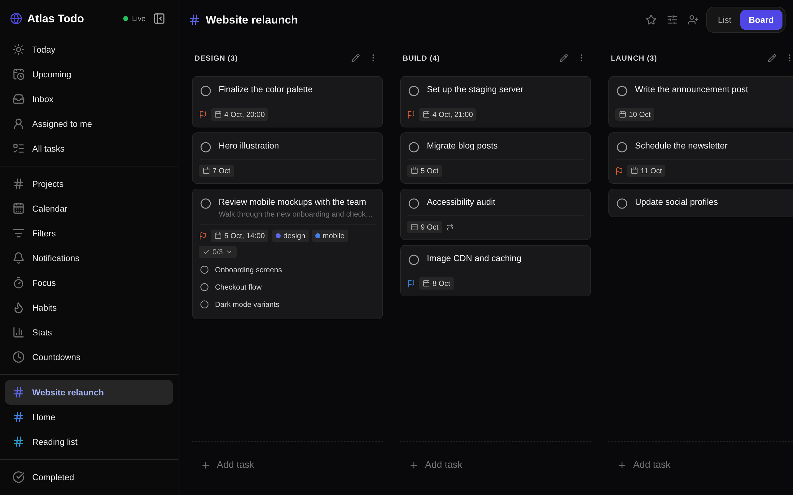
  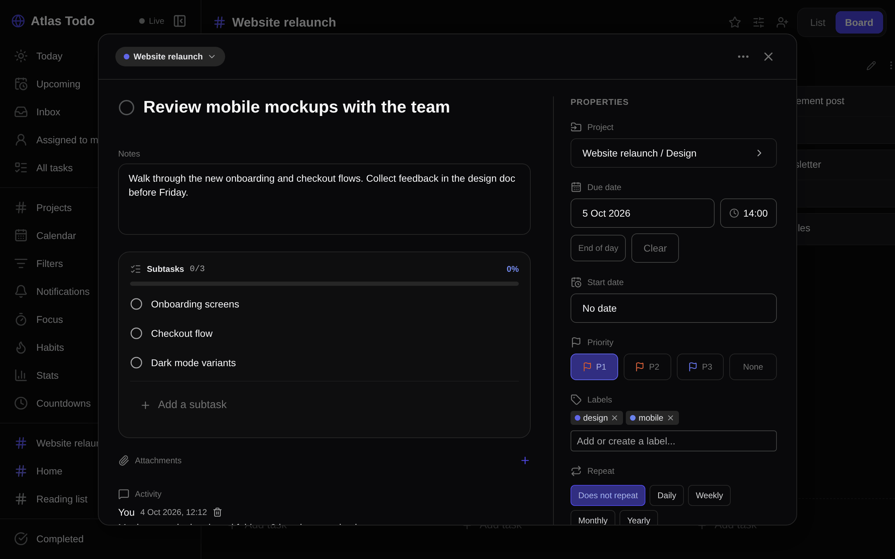
</p>

<p>
  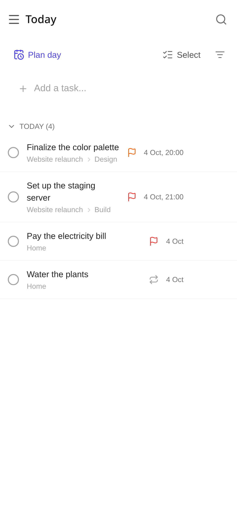
  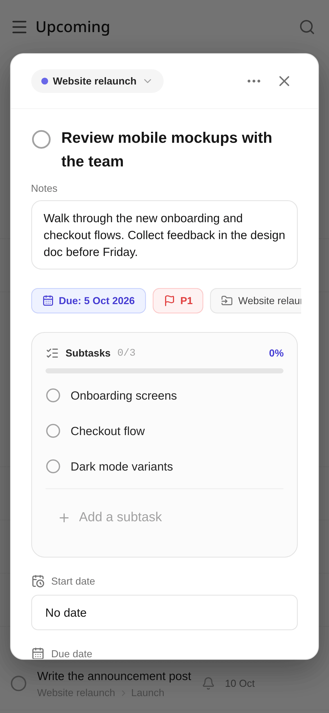
  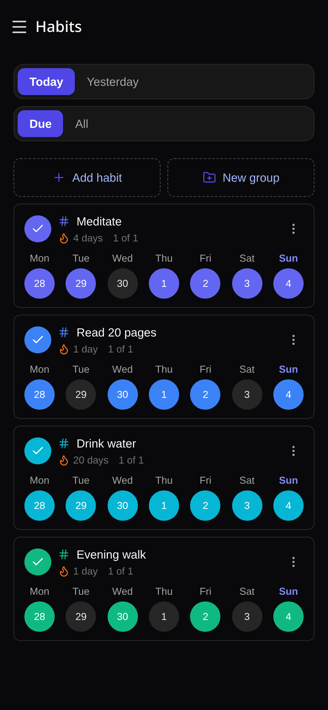
</p>

## Features

- End-to-end encryption: Task titles, notes, project names, labels, comments, habits and
  attachments are encrypted on your device. See [Security model](#security-model).
- Offline-first sync: Every change is saved locally first and synced as a log of
  field-level edits. Concurrent edits merge per field. Other devices update live over a
  WebSocket.
- Sharing: Invite people on the same server to a project as editors or commenters. Owners
  can promote members. Assign tasks, comment and see an activity feed.
- Tasks: Projects, sections, labels, subtasks, priorities, start and due dates, a trash and
  an archive.
- Recurrence: Repeat rules that step by calendar day in your time zone.
- Reminders: Local notifications on Android and desktop. In a browser they fire while the
  tab is open.
- Views: Inbox, Today, Upcoming, list, board (kanban), calendar, saved filters and
  countdowns.
- Quick add: Type "tomorrow 5pm" or "friday" and the date is set for you. Keyboard
  shortcuts and a command palette on web and desktop.
- Habits: Scheduled habits with check-ins and streaks.
- Focus: A pomodoro timer that logs focus time against tasks, plus productivity stats.
- Attachments: Files and images on tasks, encrypted before upload.
- Import and export: Import a TickTick CSV export. Back up and restore your data as JSON.
- Admin panel: Manage accounts, close signups, create signup invites, read bug reports and
  review the audit log.
- Languages: English and Danish.
- Platforms: Web (served by your server), Android, and a Linux desktop app (Electron).

## Architecture

```
 apps/mobile (React Native + Expo)     apps/electron
   Android app   web app (RN-web) ───► desktop shell around the web export
        │              │
        └── packages/client-core ──── local store (SQLite / IndexedDB), sync client, E2EE
            packages/shared ────────── pure TS logic: recurrence, filters, quick add, habits, …
                       │
                HTTPS + WebSocket (ciphertext ops)
                       │
 crates/atlas-server (Axum) ─── PostgreSQL: op log, per-user state, accounts, wrapped keys
 crates/atlas-core ──────────── pure Rust: HLC and op types
```

Clients record each edit as an operation on one field, stamped with a hybrid logical clock. The
newest stamp wins per field, so replaying operations in any order gives the same result. The
server keeps an append-only log per user and copies operations on shared projects to every
member. [docs/architecture.md](./docs/architecture.md) covers sync, the clock and the key
hierarchy.

## Self-hosting

You need Docker with Compose v2.24 or later. On NixOS, the repository flake has a
`services.atlas-todo` module instead; see [NixOS](./docs/self-hosting.md#nixos).

```sh
git clone https://github.com/atlastodo/atlas-todo.git
cd atlas-todo
cp .env.example .env
# Edit .env and set:
#   POSTGRES_PASSWORD   e.g. the output of: openssl rand -hex 24
#   JWT_SECRET          e.g. the output of: openssl rand -hex 32
docker compose up -d
```

Open <http://localhost:8080> and create an account. One container serves the web app and the
API, and applies database migrations when it starts. Run compose commands from the repository
root so it reads the root `.env`.

Signing up never makes anyone an admin. Create your account, then promote it:

```sh
docker compose exec server atlas-server promote you@example.com
```

The admin panel is at `/admin`.

[docs/self-hosting.md](./docs/self-hosting.md) has the full settings reference, reverse-proxy
examples, backups, upgrades and closing registration.

## Client apps

The apps have no built-in server. The sign-in screen has a _Server URL_ field, so you point the
app at your own instance.

- Web: your server serves the web app at its root URL. There is nothing to configure.
- Android: download `atlas-todo-X.Y.Z.apk` from
  [GitHub Releases](https://github.com/atlastodo/atlas-todo/releases) and install it.
- Desktop (Linux): each release has `atlas-desktop-X.Y.Z.tar.gz`, which contains the app and a
  Nix flake for x86_64 and aarch64 Linux. See [apps/electron/README.md](./apps/electron/README.md)
  for the Nix setup.
- iOS: there is no published build. You can build one yourself with Expo EAS and an Apple
  Developer account; see [apps/mobile/RELEASE.md](./apps/mobile/RELEASE.md).

## Development

The dev environment is [devenv](https://devenv.sh) (Nix). It provides Rust, Node 26, Bun and
PostgreSQL.

```sh
devenv shell           # enter the environment
cp .env.example .env   # then set JWT_SECRET
devenv up              # start PostgreSQL (in its own terminal)
db:migrate
dev                    # API + web app with live reload
test:all               # all test suites
lint                   # rustfmt, clippy and TypeScript checks
```

[CONTRIBUTING.md](./CONTRIBUTING.md) covers the setup, the test runners, commit style and what
CI checks.

## Security model

Your password never leaves your device. The app derives a login hash for the server and a key
that unlocks your encryption keys. Field values are encrypted with AES-256-GCM before they sync,
and shared projects use a per-project key sealed to each member's public key.

The server sees who you are, which entities exist, when they change and a few plaintext routing
fields such as a task's project id. It cannot read titles, notes, names or attachment contents.
A 24-word recovery phrase, shown at signup, is the only way back if you forget your password.

[SECURITY.md](./SECURITY.md) has the threat model, its limits and how to report a vulnerability.

## Repository layout

```
crates/atlas-core     Rust: HLC and op log types (pure, no I/O)
crates/atlas-server   Rust: Axum HTTP + WebSocket API over PostgreSQL (sqlx)
migrations/           sqlx migrations, the source of truth for the schema
apps/mobile           React Native + Expo: the one UI, for Android, iOS and the web
apps/electron         Electron shell around the web export
packages/client-core  TS: local store, sync client, E2EE
packages/shared       TS: portable pure logic (recurrence, filters, habits, stats, i18n, …)
test-vectors/         JSON fixtures shared by the Rust and TypeScript tests
docker/               Dockerfile and the compose stack (included by compose.yaml)
nix/                  The desktop flake shipped inside the desktop tarball
docs/                 Self-hosting and architecture guides
```

## License

Atlas Todo is licensed under the [GNU Affero General Public License v3.0 only](./LICENSE).
If you run a modified version as a network service, the AGPL requires you to offer its source
to your users.

Contributions are welcome; see [CONTRIBUTING.md](./CONTRIBUTING.md) and the
[Code of Conduct](./CODE_OF_CONDUCT.md).
